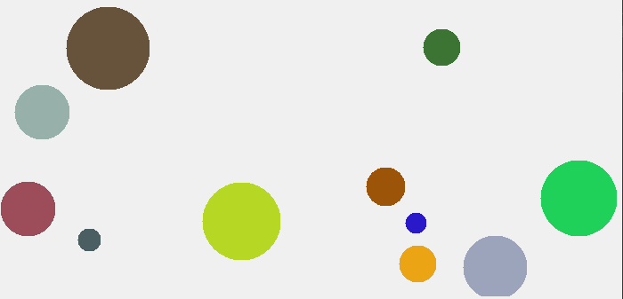

# LIS3092 class assignments
This GitHub repository is the centralized place where all the work that has been done individually is stored and organized. Here you can find projects, tasks, exercises and any other activity that has been carried out without the collaboration of third parties. In addition, the repository allows you to keep track of the versions of the works and track the updates and improvements that are made over time.

## Deliverables
- **[Collision - ballons](https://github.com/mandorc/LIS3092-class-assignments/tree/main/src/Moving-ballon):** Inside the picturebox you can animate the bouncing of a ball programmatically. To make it interesting, the speed of the ball can be varied and allow the addition of more balls to the stage. In order for the balls to interact with each other, they can be made to bounce off each other as they move, creating a collision effect that brings the game to life. By adding more balls, they can be made to start with random direction and speed, adding more diversity and excitement to the game. To make the game even more interesting, the balls can be varied in size, speed and direction, which will generate a more complex and challenging game. With at least five balls on the stage, the bouncing ball animation will become an engaging and entertaining game.

- **[Particle system](https://github.com/mandorc/LIS3092-class-assignments/tree/main/src/Particle-system-texture):** - Two particle systems are made, the first being a [basic version](https://github.com/mandorc/LIS3092-class-assignments/tree/main/src/Particle-system) and the second one a bit more complex with the use of textures.
